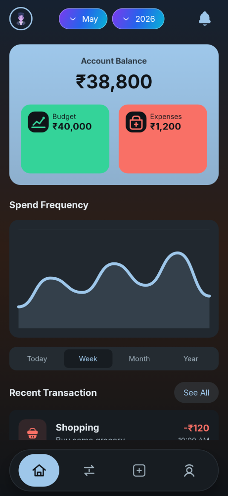
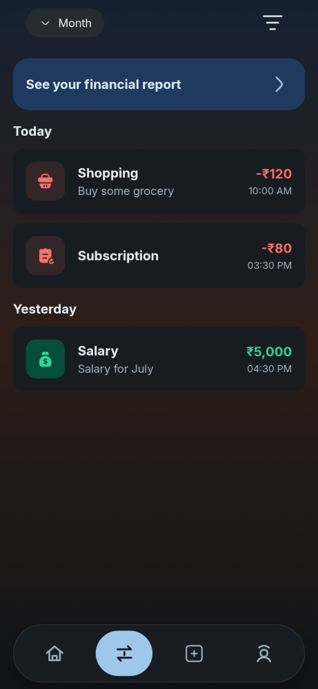
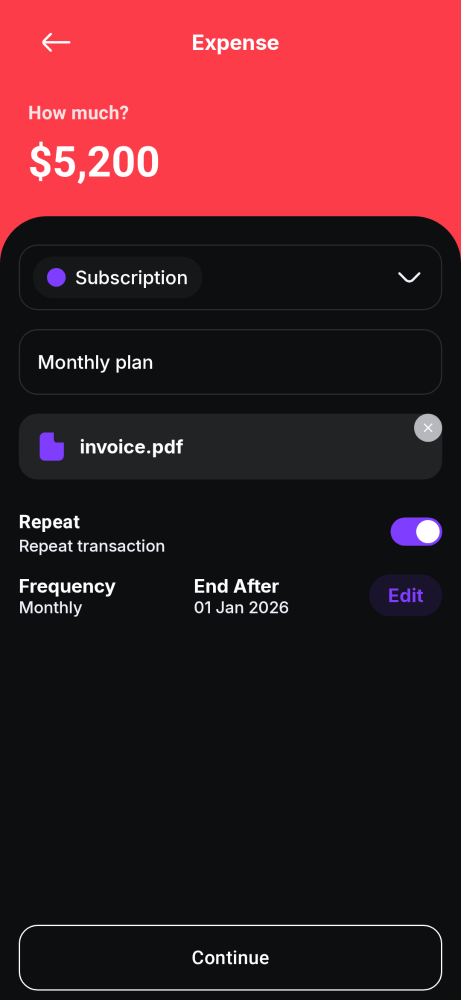

<!-- Copyright (c) 2026 shyakdas -->

# MoneyTrack

[](https://github.com/shyakdas/moneytrack-expense-tracker/actions)
[](https://github.com/shyakdas/moneytrack-expense-tracker/actions)
[](https://github.com/shyakdas/moneytrack-expense-tracker/security/dependabot)
[](https://codecov.io/gh/shyakdas/moneytrack-expense-tracker)

MoneyTrack is a privacy-first Android expense tracker focused on local-first money management.
It is being built as a clean, modern Jetpack Compose application with offline storage, app lock, onboarding, recurring expense support, and a reusable design system.

## Project Overview

MoneyTrack is for users who want:
- local data storage instead of cloud-first finance apps
- a simple budget and expense workflow
- PIN protection and privacy-focused behavior
- modern Android architecture and test coverage

Current implemented flows include:
- onboarding
- PIN setup and PIN authentication
- budget setup and dashboard summary
- expense entry with attachments and recurring scheduling
- transaction history
- reminder and notification groundwork

## Screenshots

Current screenshots below are generated from the app's Paparazzi snapshot suite.

| Home | Transaction |
| --- | --- |
|  |  |

| Onboarding | Expense |
| --- | --- |
|  |  |

## Tech Stack

- Kotlin
- Jetpack Compose
- Material 3
- Navigation Compose
- Hilt
- Room
- DataStore
- Firebase Remote Config
- Paparazzi
- ktlint
- detekt
- Jacoco
- GitHub Actions

Android configuration:
- `compileSdk = 36`
- `targetSdk = 36`
- `minSdk = 24`

## Architecture

MoneyTrack follows a feature-first structure with clear separation between presentation, domain, and data layers.

Modules:
- `:app`
- `:DesignSystem`

App package structure:

```text
com.moneytrack
├── data
├── expense
│   ├── data
│   ├── domain
│   ├── presentation
│   └── scheduler
├── home
│   ├── data
│   ├── domain
│   └── presentation
├── onboarding
│   ├── data
│   ├── domain
│   └── presentation
├── pinauth
├── pinsetup
├── reminder
│   ├── data
│   ├── domain
│   ├── notification
│   └── presentation
├── security
│   ├── data
│   ├── domain
│   └── di
├── startup
├── transaction
│   ├── data
│   ├── domain
│   └── presentation
└── navigation
```

High-level boundaries:
- `presentation`: Compose UI, route wiring, ViewModels
- `domain`: use cases and feature models
- `data`: repositories, local persistence, integrations
- `DesignSystem`: shared components, tokens, navigation bars, cards, form controls

## Setup

### Requirements

- Android Studio latest stable
- JDK 11
- Android SDK 36

### Clone

```bash
git clone https://github.com/shyakdas/moneytrack-expense-tracker.git
cd moneytrack-expense-tracker
```

### Firebase Config

The project already uses flavor-based Firebase config files:
- `app/src/dev/google-services.json`
- `app/src/prod/google-services.json`

If you use your own Firebase projects, replace those files with your own configs.

### Open in Android Studio

1. Open the project folder
2. Sync Gradle
3. Select the `devDebug` variant for local work
4. Run the app on an emulator or device

### Build from Terminal

```bash
./gradlew :app:assembleDevDebug
```

## Running Tests

### Static Analysis

```bash
./gradlew :app:ktlintCheck :app:detekt :app:lintDevDebug
```

### Unit Tests

```bash
./gradlew :app:testDevDebugUnitTest
```

### UI Test Compilation

```bash
./gradlew :app:compileDevDebugAndroidTestKotlin
```

### Screenshot Tests

Record snapshots:

```bash
./gradlew :app:recordPaparazziDevDebug
```

Verify snapshots:

```bash
./gradlew :app:verifyPaparazziDevDebug
```

### Coverage

```bash
./gradlew :app:jacocoTestReport
```

## CI

GitHub Actions in this repository run:
- PR quality checks
- nightly validation
- APK build on main
- PR rule validation

Workflows:
- `.github/workflows/pr-quality-checks.yml`
- `.github/workflows/nightly.yml`
- `.github/workflows/build-apk-main.yml`
- `.github/workflows/pr-rules.yml`

## Contributing

Contributions are welcome, but consistency matters.

Before opening a PR:
- keep architecture boundaries intact
- add or update tests for behavior changes
- keep lint, detekt, and snapshot verification green
- include screenshots for visible UI changes

Project contribution docs:
- [CONTRIBUTING.md](CONTRIBUTING.md)
- [CODE_OF_CONDUCT.md](CODE_OF_CONDUCT.md)
- [SECURITY.md](SECURITY.md)

## Roadmap

Planned and in-progress areas:
- richer transaction filters and reporting
- budget insights and category analytics
- settings and reminder customization
- more complete recurring expense management
- broader UI and screenshot coverage across all flows
- hardening for public open source collaboration

## License

This project is licensed under the MIT License.
See the [LICENSE](LICENSE) file for details.
